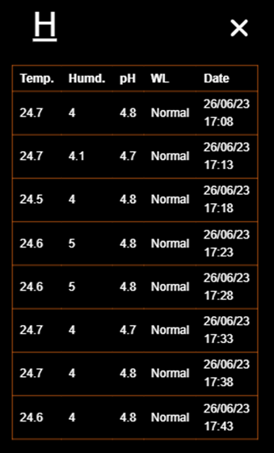

<h3>Applicatio details</h3>
The application is developed using HTML, CSS, PHP, JS and Python. The Application named as HNet.
HNet is a web/mobile based application that is used to maintain and monitor a Smart Horticulture Farming. Smart Horticulture Farming includes an IoT based hydroponic system. First a user has to login to the system using his username and password.

After login successfully, the user will be able to access his dashboard. 

The dashboard has 6 options. It is mainly divided into 3 sections.

* **Monitor and Maintenance**
* **Guideline Providing**
* **Disease detection and Solution Providing**
     
1. **Monitor and Maintenance**

   ‘Cultivation History’, ‘Live Sensor’, ‘Sensor Activity’, ‘Disease History’ are the features of Monitoring the system. To change the cultivation plant, there is a option called ‘Change Plant’

   a. **Cultivation history**
  
   The cultivation history and the duration are presented inside a table.
  
   

   b. **Live Sensor**

   The ‘Live Sensor’ shows the actual situation of the sensors.

   

   c. **Sensor Activity**

   The sensor activity shows the recent history of the sensor data.

   

   d. **Disease History**

   The recent detected diseases with the detection date is presented in the ‘Disease History’ option.

   

   e. **Plant details and Cultivation Changing**

   Within this option, a user can change the cultivation plant.

   

   Also, the plant description of each plant can be seen from plant details option.

   

2.	**Guideline Providing**
   
    The guideline providing feature is named as ‘notification’. It notify the used if there is any unwanted situation.

    

3. **Disease detection and Solution Providing**

   a. **Disease detection:**

   To detect the disease, user has to input four images. The user can add some description if he wants.

   

   b. **Solution Providing:**

   The disease is detected using DL model and returns the disease name and solution of the disease.

   

<h4>The disease detection dataset can be found in the Kaggle. The link is given below:</h4>
https://www.kaggle.com/datasets/ahammadmejbah/nadimbhaia/data
